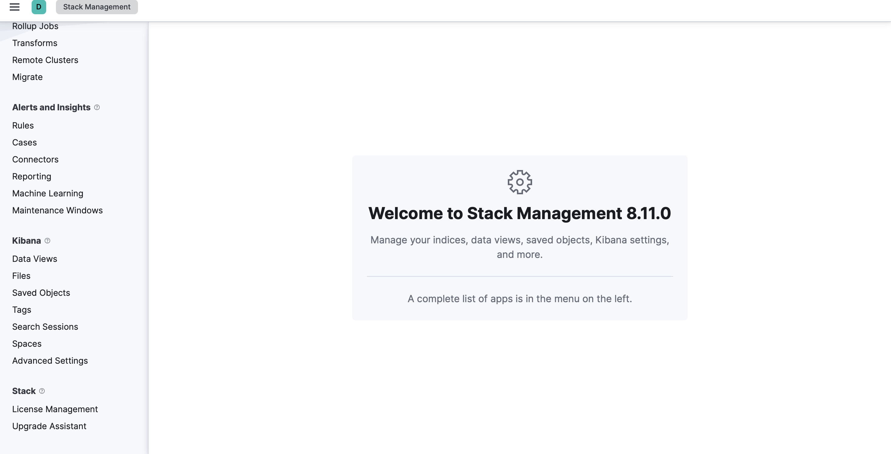
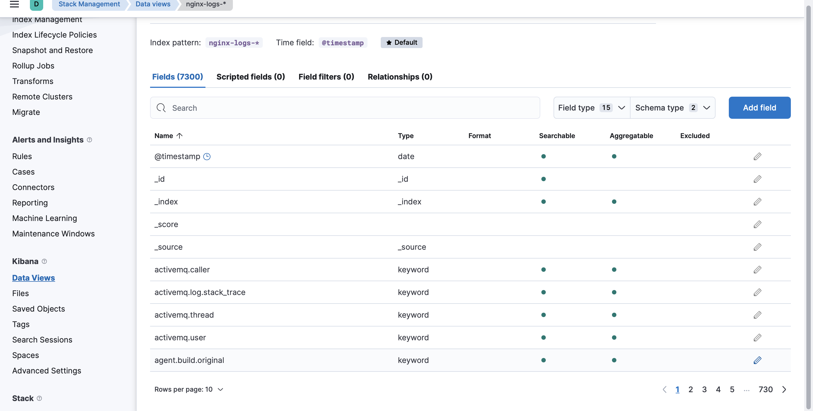
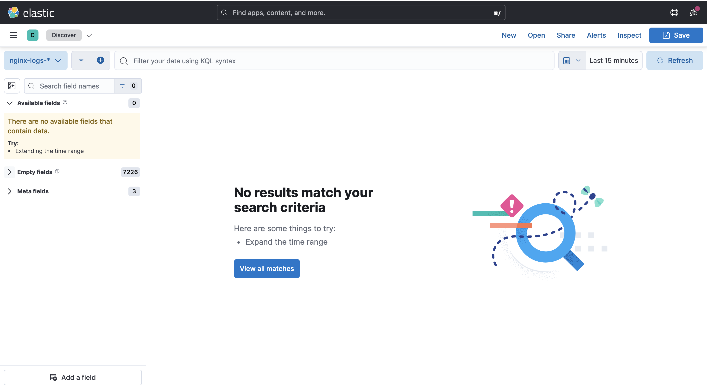

# 🛒 Django E-commerce - Containerization & Orchestration

> **Module :** Containerization & Orchestration  
> **Enseignant référent :** Maxime CORDEIRO  
> **Auteurs :** Ahmat ROUCHAD
>           ** Jean-eudes WANDJI
>           ** Mileina MALOU
>           ** Yobe GNADAME  
> **Promotion :** ESILV M1


## 📋 Description du Projet

Ce projet est une application e-commerce complète développée avec **Django**, conteneurisée et orchestrée via **Docker Compose**. L'objectif principal de ce module était de mettre en place une architecture micro-services robuste, sécurisée et observable.

Le projet intègre une **stack ELK (Elasticsearch, Kibana, Filebeat)** complète pour la centralisation et l'analyse des logs du serveur web Nginx, permettant un monitoring en temps réel du trafic, des erreurs et des performances.

## 🏗 Architecture Technique

L'application est décomposée en services interconnectés :
| Service | Rôle | Technologie |
| :--- | :--- | :--- |
| **WebApp** | Backend logique et API | Django (Gunicorn) |
| **Database** | Persistance des données | PostgreSQL 15 |
| **Nginx** | Reverse Proxy & Fichiers statiques | Nginx (Alpine) |
| **Elasticsearch** | Moteur de recherche & Stockage logs | Elasticsearch 8.11 |
| **Kibana** | Visualisation & Dashboards | Kibana 8.11 |
| **Filebeat** | Collecteur de logs léger | Filebeat 8.11 |
| **Prometheus** | Stockage et requêtage des métriques | Prometheus |
| **Grafana** | Visualisation et création de Dashboards | Grafana |
| **Node-Exporter** | Collecte des métriques du système hôte | Prometheus Exporter |
| **cAdvisor** | Collecte des métriques des containers (CPU/RAM) | Google cAdvisor |

### Points Forts de l'implémentation
* **Logs JSON :** Configuration Nginx personnalisée pour générer des logs au format JSON pur, facilitant l'ingestion.
* **Optimisation :** Limitation de la mémoire (Heap Size) pour faire tourner la stack ELK sur des machines à ressources limitées.
* **Sécurité :** Utilisation d'utilisateurs non-root là où c'est possible et gestion des secrets via variables d'environnement.

---

## 🚀 Installation et Démarrage

### Prérequis
* Docker Desktop & Docker Compose
* Git
* Au moins 4GB de RAM allouée à Docker

### 1. Cloner le projet

```bash
git clone [https://github.com/ESILVM1/conterisation-orchestration.git](https://github.com/ESILVM1/conterisation-orchestration.git)
cd django_ecommerce_mod5
```

### 2. Lancer l'environnement

```Bash
docker compose up -d --build
```
Note : Le démarrage initial d'Elasticsearch et Kibana peut prendre 2 à 3 minutes.

### 3 Vérifier l'état des services

```Bash
docker compose ps
```

### 4. Initialiser les données de démo (Optionnel)
Un script Python est inclus pour peupler la base de données avec des produits et un utilisateur test :

```Bash
docker compose exec web python load_demo_data.py
```

```
Admin Panel : https://www.google.com/search?q=http://localhost/admin (User: admin / Pass: admin123)
```
## Utilisation de la Stack ELK
```
L'architecture de logging suit le flux : Nginx (JSON) ➔ Filebeat ➔ Elasticsearch ➔ Kibana.
```

## Accès aux interfaces
```
Site E-commerce : http://localhost
Kibana (Dashboard) : http://localhost:5601
Configuration Rapide de Kibana
Ouvrez http://localhost:5601.
Allez dans Stack Management > Index Patterns(Data View).
Créez un pattern nommé nginx-logs-*.
Sélectionnez @timestamp comme champ temporel.
```
## Génération de Trafic de Test
Pour visualiser des données intéressantes dans Kibana, utilisez le script fourni qui simule des visiteurs, des erreurs 404 et des accès aux ressources statiques :
```Bash

chmod +x generate_traffic.sh
./generate_traffic.sh
```
Une fois le script exécuté, rendez-vous dans l'onglet Discover ou Dashboard de Kibana pour analyser les résultats.
### Monitoring Système (Bonus)
Pour compléter l'observabilité applicative (Logs), une solution de monitoring système (Métriques CPU/RAM) a été mise en place via Prometheus et Grafana.
## 🔗 Accéder au dépôt Monitoring : ```https://github.com/rdout2/Monitoring_Grafana_prometheus```

### 📸 Captures d'écran




### Structure du Projet

```text
django_ecommerce_mod5/
├── docker-compose.yml          # Orchestration des services
├── Dockerfile                  # Construction de l'image Django
├── nginx-full.conf             # Configuration Nginx optimisée (Logs JSON)
├── generate_traffic.sh         # Script de simulation de trafic
├── requirements.txt            # Dépendances Python
├── elk/                        # Configuration de la Stack ELK
│   ├── elasticsearch/config.yml
│   ├── kibana/config.yml
│   └── filebeat/config.yml
└── store/                      # Code source de l'application Django
```

### 👤 Auteurs
Projet réalisé par **Ahmat ROUCHAD, Jean-eudes WANDJI, Mileina MALOU, Yobe GNADAME** dans le cadre du Master 1 à l'ESILV.
